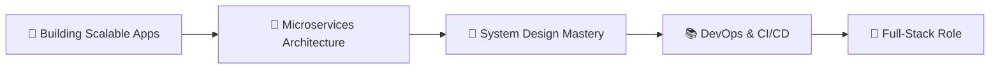

<div align="center">
  
<!-- Add your custom banner here -->


# 👋 Hi there, I'm **Md. Jubaer-Al-Imran Khan**! 
### 🚀 Full-Stack Software Engineer | 💻 MERN Stack Specialist | ⚡ Building Scalable Solutions

[](https://portfoliodev-five-nu.vercel.app)
[](https://www.linkedin.com/in/jubaer226/)
[](mailto:jubaerkhan226@gmail.com)
[](https://wa.me/+8801767092988)


</div>

---

## 🎯 **Currently Seeking: Full-Stack Developer Position**

> **Passionate Full-Stack Developer** with a proven track record in crafting exceptional digital experiences. I specialize in modern web technologies to build high-performance, scalable applications that drive business growth and deliver outstanding user experiences. **Ready to transform your vision into powerful, production-ready solutions!** ✨

<div align="center">

### 🌟 **Quick Highlights**
**10+ Projects Delivered** • **3+ Years of Excellence** • **10+ Tech Mastery Areas** • **Production-Ready Applications**

</div>

---

## 🧑‍💻 **About Me - The Developer Behind the Code**

```javascript
const developer = {
  name: 'Md. Jubaer-Al-Imran Khan',
  title: 'Full-Stack Software Engineer',
  location: 'Panchagarh, Bangladesh 🇧🇩',
  
  expertise: [
    'React.js', 'Next.js', 'Node.js', 'Express.js', 
    'TypeScript', 'JavaScript', 'MongoDB', 'PostgreSQL',
    'Material UI', 'Tailwind CSS'
  ],
  
  passionDriven: true,
  innovativeThinking: true,
  problemSolver: true,
  teamPlayer: true,
  
  readyToHire: function() {
    return (
      this.passionDriven &&
      this.problemSolver &&
      this.expertise.length >= 10
    );
  }
};

console.log(developer.readyToHire()); // Output: true ✅
```

---

## 🚀 **Professional Journey**

<table>
<tr>
<td width="50%">

### 🎓 **Education**
- **B.Sc. in Electrical & Electronic Engineering (EEE)**  
  *Hajee Mohammad Danesh Science & Technology University*
- **Full-Stack Web Development**  
  *Programming Hero (Batch-6)*

</td>
<td width="50%">

### 💼 **Experience**
- **Full-Stack Developer**  
  *Black Hat Bucks Tech Pvt Ltd*
- **20+ Production Projects**
- **Real-world Application Development**
- **Professional Team Collaboration**

</td>
</tr>
</table>

---

## 🛠️ **Tech Arsenal**

<div align="center">

### **Frontend Mastery** 🎨


### **Styling & UI Frameworks** 💅


### **Backend & Database** 🗄️


### **State Management & Libraries** 📚


### **Tools & DevOps** ⚙️


</div>


---

## 🏆 **What Sets Me Apart**

<div align="center">

<table>
<tr>
<td align="center" width="25%">

<br><strong>Engineering Precision</strong>
<br><small>Unique fusion of engineering logic and creative design thinking</small>
</td>
<td align="center" width="25%">

<br><strong>Problem Solving</strong>
<br><small>Advanced expertise with proven system architecture design skills</small>
</td>
<td align="center" width="25%">

<br><strong>Security Focus</strong>
<br><small>Extensive experience crafting secure authentication systems</small>
</td>
<td align="center" width="25%">

<br><strong>Rapid Adaptation</strong>
<br><small>Passionate learner who thrives in dynamic environments</small>
</td>
</tr>
</table>

</div>

---

## 🎨 **Portfolio Showcase**

<div align="center">

### 🌟 **My Complete Portfolio Website**
*Built with React.js, Tailwind CSS, and modern animations*

[](https://portfoliodev-five-nu.vercel.app)

**Features:**
✅ Responsive Design  
✅ Interactive Animations  
✅ Dynamic Skill Gauges  
✅ Project Showcases  
✅ Contact Integration  

</div>

---

## 🚀 **Current Focus & Goals**

<div align="center">



</div>

- 🔭 Developing **scalable full-stack applications** with Next.js & Node.js
- 🌱 Exploring **microservices architecture** & **cloud deployments**
- 🎯 Enhancing **system design** & **advanced backend practices**
- 📚 Learning **DevOps tools** and **CI/CD pipelines**
- 💼 Seeking **Full-Stack Developer** opportunities

---


## 🏅 **GitHub Trophies**

<div align="center">

[](https://github.com/ryo-ma/github-profile-trophy)

</div>

---

## 💡 **Fun Facts About Me**

<div align="center">

<table>
<tr>
<td align="center">

<br><strong>Code Philosophy</strong>
<br><em>"Every line of code is a building block toward a better digital future"</em>
</td>
<td align="center">

<br><strong>Debug Style</strong>
<br><em>I debug with console.log and I'm proud of it! 😄</em>
</td>
<td align="center">

<br><strong>Learning Mode</strong>
<br><em>Always exploring new technologies and frameworks</em>
</td>
</tr>
</table>

</div>

---

## 🤝 **Let's Connect & Build Something Amazing**

<div align="center">

I'm actively seeking **Software Engineer** or **Full-Stack Developer** roles where I can leverage my technical expertise to build innovative solutions and contribute meaningfully to organizational success.

### 📫 **Get In Touch**

[](https://portfoliodev-five-nu.vercel.app)
[](https://www.linkedin.com/in/jubaer226/)
[](mailto:jubaerkhan226@gmail.com)
[](https://wa.me/+8801767092988)

### 💬 **Open to discuss:**
🚀 **New Opportunities** • 💡 **Innovative Projects** • 🤝 **Collaborations** • 💻 **Tech Discussions**

---

<div align="center">

### *"Code is like humor. When you have to explain it, it's bad."* – Cory House

**⭐ Star my repositories if you find them useful!** ⭐

 <em><b>Happy Coding!</b></em> 

</div>

</div>
